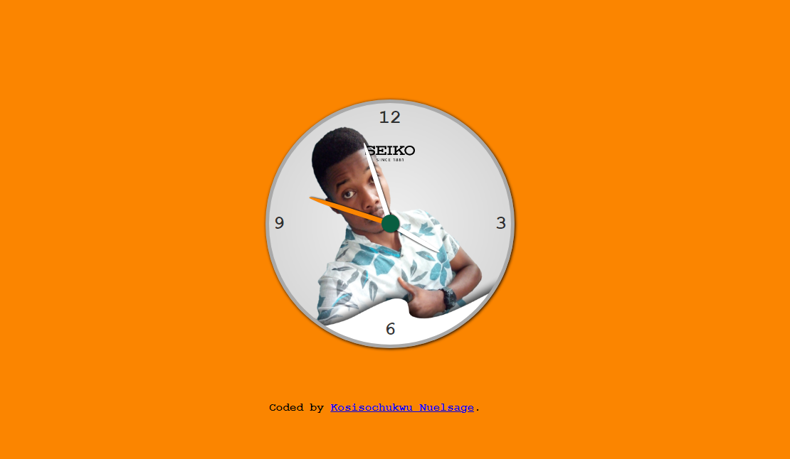

<<<<<<< HEAD

# Analog-clock

During my learning journey of html, css and javascript I decided to practice My skills on an analog clock that works and show
real time. So this is it. You can make your suggestions too. Thank you

### Links

- Solution URL: [here](https://github.com/Sage-hex/Qr-code-component)
- Live Site URL: [here](https://nuelsage-qr-code-component.netlify.app/)

### Built with

- Semantic HTML5 markup
- CSS custom properties
- Flexbox
- CSS Grid
- Mobile-first workflow

## Author

- Website - [Kosisochukwu Emmanuel(Nuelsage)](https://www.twitter.com/nuel2sage)
- Frontend Mentor - [@sage-hex](https://www.frontendmentor.io/profile/sage-hex)
- Twitter - [@nuel2sage](https://www.twitter.com/nuelsage)
=======

>>>>>>> eb0988e553265f350d5db67c0e44d4964dfe4029
